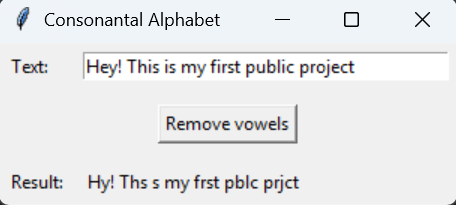

# Consonantal Alphabet - Decomposition
A small Python project that demonstrates a **Tkinter GUI** which removes all vowels from a given text.  
Inspired by a university assignment about consonantal alphabets (e.g., Phoenician), where texts are written without vowels.

 

## Features
- Text input via an **Entry** field  
- Removes all vowels (uppercase and lowercase)  
- Shows the result with a single click  
- Structured GUI layout (Label + Entry + Button + Result)  
- Example/demo text included: `"Hey! This is my first public project"`  

## Technologies
- **Python 3.10+**  
- **Tkinter** (usually included with Python)  

## Project Structure
ConsonantalAlphabet/  
│  
├── consonantal_alphabet.py  
├── README.md  
└── img/    
└── gui-screenshot.png

## Installation & Usage
1. Clone the repository:
```bash
git clone https://github.com/aminatre/consonantal-alphabet.git
```

2. Navigate into the project folder:
```bash
cd consonantal-alphabet
```

3. Run the script:
```bash
python consonantal_alphabet.py
```

4. Enter text in the field and click Remove vowels to see the result.

## What I Learned
- Creating GUI applications with Tkinter
- Handling user input and updating GUI dynamically
- Structuring small Python projects for clarity
- Basic string manipulation (removing vowels)

## Future Improvements
- Add support for different alphabets or languages
- Provide a copy-to-clipboard button
- Add error handling for empty input

## Project Status
Completed – GUI fully functional, enhancements planned.
